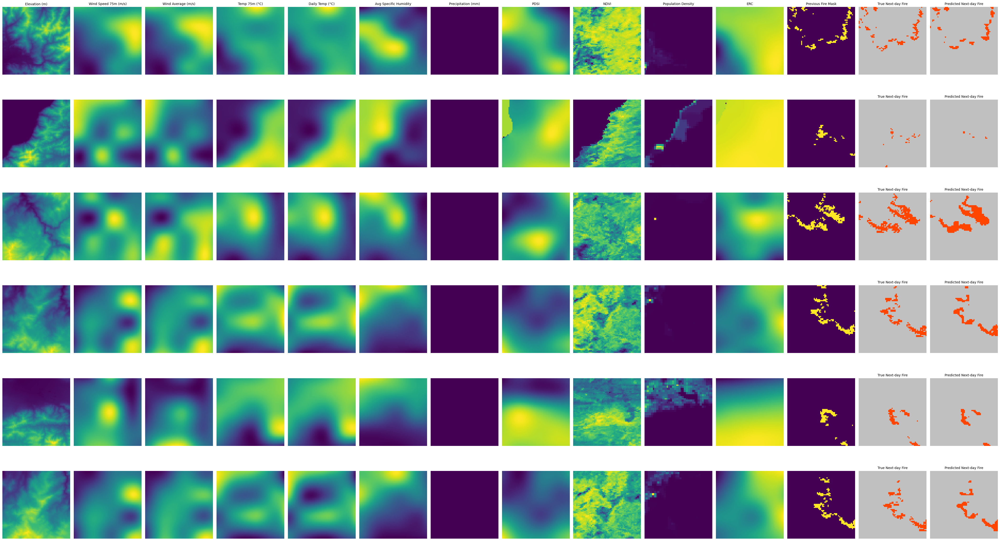
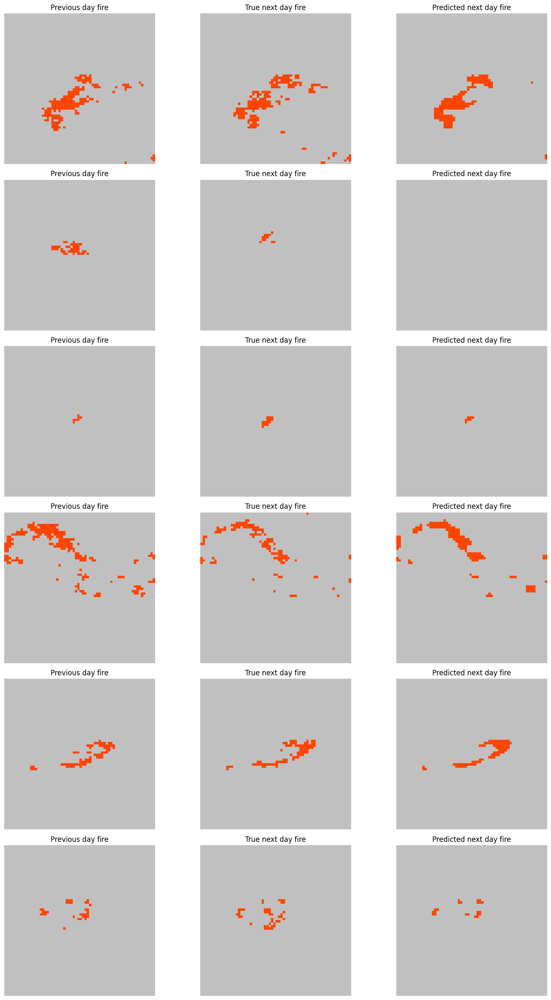

# 🔥 Wildfire Spread Prediction

A deep learning project to predict **next-day wildfire spread** using satellite imagery and weather data.

---

## 📁 Folder Structure

```
WSP/
├── ndws_western_dataset/          # Folder to store the dataset (download separately)
│   └── README.md                  # Instructions to download dataset (delete after use)
├── main.ipynb                     # Main training and inference code
├── test.ipynb                     # Simple script to run/test predictions
├── output_normal.png              # Sample output without feature overlays
├── output(WithFeatures).png       # Sample output with important feature overlays
├── requirements.txt               # Python libraries required to run the project
└── README.md                      # This file
```

---

## 🚀 How to Use

### 1. Clone this Repository

```bash
git clone https://github.com/your-username/Wildfire-Spread-Prediction.git
cd Wildfire-Spread-Prediction
```

### 2. Install Dependencies

```bash
pip install -r requirements.txt
```

> It's recommended to use a virtual environment like `venv` or `conda`.

---

### 3. Download the Dataset

* Go to `ndws_western_dataset/README.md` for instructions
* Download and extract the dataset into `ndws_western_dataset/`
* Delete the `README.md` file inside that folder after dataset is placed

---

### 4. Run the Code

#### 🧠 Training & Prediction:

Open and run `main.ipynb` in Jupyter Notebook or any supported IDE.
This file:

* Loads the dataset
* Processes input features
* Trains the wildfire prediction model
* Displays predicted wildfire spread outputs

#### 🧪 Quick Testing:

Use `test.ipynb` for simplified testing on specific samples.

---

## 📊 Output Examples

| With Features             | Without Features                           |
| ---------------------------- | --------------------------------------- |
|  |  |

---

## 🧠 About the Model

* Utilizes U-Net model

---

## 👌 Contributions

Pull requests and suggestions are welcome!

---

## Contact

ajaygudise03@gmail.com